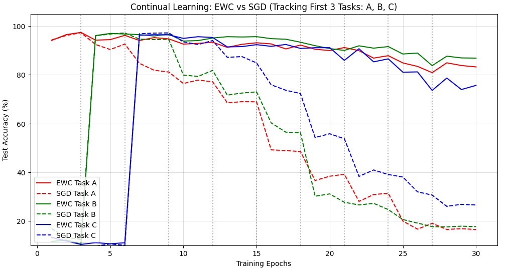
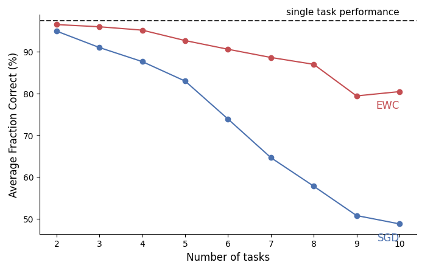
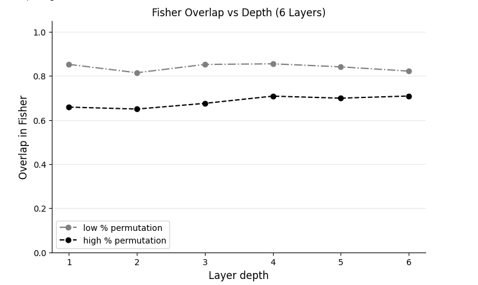

# Catastrophic Forgetting & Online EWC Reproduction Project
> ** Orignal paper**
>*James Kirkpatrick, Razvan Pascanu, Neil Rabinowitz, Joel Veness, Guillaume Desjardins, Andrei A. Rusu, Kieran Milan, John Quan, Tiago Ramalho, Agnieszka Grabska-Barwinska, Demis Hassabis, Claudia Clopath, Dharshan Kumaran, Raia Hadsell (2017)*

> *Overcoming catastrophic forgetting in neural networks*
> arXiv:1312.6211v3

The project evaluates a Continual Learning scenario over multiple sequential tasks using the **Permuted MNIST** dataset.
this project is part of a submission for a course in python by students: Amit Nigerker and Yuval Holoidovsky
## Table of Contents
- [Academic documentation](#Academicdocumentation)
- [Background](#background)
- [Project Overview](#project-overview)
- [Architecture & Parameters](#architecture--parameters)
- [Results & Evaluation](#results--evaluation)
- [Installation & Running](#installation--running)
- [Dependencies](#dependencies)

---
## Academic documentation
Based on the need to document every step we took to achieve our results.
- [Conclusions](ai_medotology.md) - Main takeaways from the project and personal assumption.
- [Ai medotology](Docs/AI_METHODOLOGY.md) - Documentation on the use of ai to code and assmble to the project.
- [EWC Model in code ](Docs/EWC_Model.md) - a short explain on how to code of EWC in our project works cell by cell.
- [Validation and testing ](Docs/EWC_VALIDATION.md) - a short explain on the vaildation and testing of EWC in the project.
- [Ai-Drafting](Docs/AI-Planning.md) -How we used Ai promtoring in its raw form to steer it in the direction we wanted.
## Background

### Catastrophic Forgetting
In connectionist networks (Neural Networks), learning tasks sequentially usually results in the network completely overriding previously acquired knowledge to adapt to the new task. This limitation is known as **Catastrophic Forgetting** and is a major hurdle toward creating general Artificial Intelligence capable of Continual Learning.

### Elastic Weight Consolidation (EWC)
EWC slows down learning on weights that are crucial for past tasks. It calculates the importance of each parameter using the **Fisher Information Matrix**. 
While regular EWC requires storing a Fisher matrix for *every single task* (which doesn't scale well), **Online EWC** optimizes this by maintaining a single running estimate of the Fisher matrix, updating it using an exponential moving average (with a memory dampening parameter $\alpha$).

---

## Project Overview

The experiment sets up a sequence of **3 consecutive tasks** based on the MNIST dataset:
1. **Task A**: Original MNIST dataset (Standard digit classification).
2. **Task B**: Permuted MNIST (Pixels shuffled using fixed random permutation map B).
3. **Task C**: Permuted MNIST (Pixels shuffled using fixed random permutation map C).

We compare two models simultaneously:
1. **Standard SGD Model**: A baseline network trained with regular Stochastic Gradient Descent across the task sequence.
2. **Online EWC Model**: A network initialized identically to the baseline but optimized with a regularization penalty based on the online Fisher information during Tasks B and C.

---

## Architecture & Parameters

### Neural Network Structure
To force rapid weight overwriting and simulate a restricted memory footprint, a compact Multi-Layer Perceptron (MLP) was constructed:
- **Input Layer**: $28 \times 28 = 784$ neurons (Flattened MNIST image).
- **Hidden Layer 1**: 400 neurons (ReLU activation).
- **Hidden Layer 2**: 400 neurons (ReLU activation).
- **Output Layer**: 10 neurons (Log Softmax / Cross Entropy for digits 0-9).

### Hyperparameters
- **Epochs per task**: 3
- **Learning Rate ($Lr$)**: 0.005
- **Momentum**: 0.9 (SGD)
- **EWC Lambda ($\lambda$)**: 1000 (Importance weight penalty)
- **Fisher Memory Dampening Factor ($\alpha$)**: 0.5
---

## Results & Graphs

The empirical results of this experiment are visualized across three structural performance benchmarks, mirroring the validation metrics of the original research.

### 1. Continual Learning Task Performance (Accuracy Timeline)
This plot tracks the real-time test accuracy on all three tasks simultaneously across the 30-epoch sequential training horizon.

* **Standard SGD (Dashed Lines)**: Suffers severely from Catastrophic Forgetting. Upon transitioning to Task B and Task C, accuracy on the original Task A falls sharply from **~98% down to 19.7%**.
* **Online EWC (Solid Lines)**: Effectively protects consolidated pathways. Even after completing Task C training, performance on Task A drops minimally, remaining robust at **77.9%**.

### 2. Average Task Retention 
This plot computes the *Average Fraction Correct (%)* across all learned tasks as the sequence scales up to evaluate structural memory preservation.

* While standard SGD's average system competence decays linearly as new domains are forced into its parameters, the **Online EWC** regularization penalty locks critical task-specific sub-spaces, maintaining high average accuracy across the lifelong learning timeline.

### 3. Fisher Overlap vs Network Depth
This plot evaluates the diagonal elements of the computed Fisher Information Matrices to measure parameter importance overlap between different tasks across the hidden structural depth of the model.

* **Low % Permutation**: Tasks with highly correlated pixel contexts show sustained, high Fisher importance overlap throughout the deep layers of the network.
* **High % Permutation**: Highly disparate contexts force the structural layers to drift apart. Overlap falls heavily as layer depth increases, forcing the model to calculate entirely distinct pathways for non-overlapping data representations.
