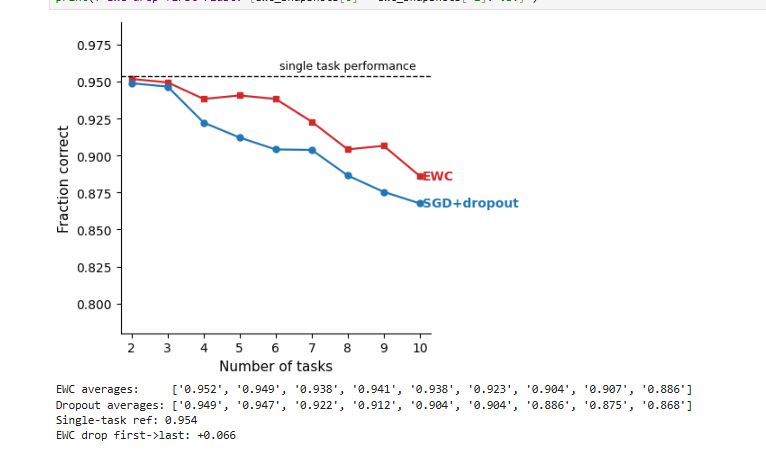

# Catastrophic Forgetting & Online EWC Reproduction Project
> ** Orignal paper**
>*James Kirkpatrick, Razvan Pascanu, Neil Rabinowitz, Joel Veness, Guillaume Desjardins, Andrei A. Rusu, Kieran Milan, John Quan, Tiago Ramalho, Agnieszka Grabska-Barwinska, Demis Hassabis, Claudia Clopath, Dharshan Kumaran, Raia Hadsell (2017)*

> *Overcoming catastrophic forgetting in neural networks*
> arXiv:1312.6211v3

The project evaluates a Continual Learning scenario over multiple sequential tasks using the **Permuted MNIST** dataset.
this project is part of a submission for a course in python by students: Amit Nigerker and Yuval Holoidovsky
## Table of Contents
- [Academic documentation](#Academicdocumentation)
- [Background](#background)
- [Project Overview](#project-overview)
- [Architecture & Parameters](#architecture--parameters)
- [Results & Evaluation](#Results--and--Graphs)
---
## Academic documentation
Based on the need to document every step we took to achieve our results.
- [Conclusions](Docs/TAKEAWAYS.md) - Main takeaways from the project and personal assumption.
- [Graphs and results](graphing_and_results.md) - the reproduction of the paper graphs and the results of the project.
- [Ai medotology](Docs/AI_METHODOLOGY.md) - Documentation on the use of ai to code and assmble to the project.
- [EWC Model in code ](Docs/EWC_Model.md) - a short explain on how to code of EWC in our project works cell by cell.
- [Validation and testing ](Docs/EWC_VALIDATION.md) - a short explain on the vaildation and testing of EWC in the project.
- [Ai-Drafting](Docs/AI-Planning.md) -How we used Ai promtoring in its raw form to steer it in the direction we wanted.
## Background
 
### Catastrophic Forgetting
In connectionist networks (Neural Networks), learning tasks sequentially usually results in the network completely overriding previously acquired knowledge to adapt to the new task. This limitation is known as **Catastrophic Forgetting** and is a major hurdle toward creating general Artificial Intelligence capable of Continual Learning.
 
### Elastic Weight Consolidation (EWC)
EWC slows down learning on weights that are crucial for past tasks. It calculates the importance of each parameter using the **Fisher Information Matrix** — specifically the diagonal of the Fisher, used as a Laplace approximation to the posterior over weights.
 
This implementation uses the **paper-exact (separate penalties) form** of EWC (equation 3 of Kirkpatrick et al.): a separate Fisher matrix and weight anchor are stored after each completed task, and the total regularization penalty is the sum across all stored tasks:
 
$$L = L_B + \sum_{\text{tasks}} \sum_i \frac{\lambda}{2} F_i (\theta_i - \theta^*_i)^2$$
 
This is distinct from the Online EWC variant, which merges all past Fishers into a single running estimate. The separate-penalties approach scales Fisher storage with the number of tasks but produces cleaner consolidation signals.
 
A key implementation detail is the **per-sample Fisher estimation**: labels are sampled from the model's own predictive distribution (rather than using true labels or batch-averaged gradients), which gives the true diagonal Fisher as defined in the paper and avoids the systematic underestimation that occurs with batch averaging.
 
---
 
## Project Overview
 
The experiment evaluates three models trained sequentially across **10 Permuted MNIST tasks**:
1. **Task 1**: Original MNIST dataset (standard digit classification).
2. **Tasks 2–10**: Permuted MNIST — pixels shuffled using a distinct fixed random permutation per task.
Three models are compared throughout the sequence:
1. **SGD**: A baseline network trained with standard Stochastic Gradient Descent, with no mechanism to protect prior tasks.
2. **L2**: A uniform quadratic regularization baseline that penalizes all weight changes equally (no Fisher-based weighting).
3. **EWC**: A network trained with the paper-exact EWC penalty. After each task its Fisher matrix and weight anchor are stored and summed into the penalty for all future tasks.
A separate **single-task reference model** is trained only on Task 1 and used as the performance ceiling (the dashed line in Figure 2B).
 
For Figure 2B, the SGD baseline is replaced with a **SGD + dropout** variant, which uses dropout regularization (0.2 on input, 0.5 on hidden layers) and per-task early stopping based on held-out validation accuracy.
 
---
 
## Architecture & Parameters
 
### Neural Network Structure (Figures 2A & 2B)
A Multi-Layer Perceptron (MLP) with configurable hidden width:
- **Input Layer**: $28 \times 28 = 784$ neurons (flattened MNIST image).
- **Hidden Layer 1**: 2000 neurons (ReLU activation).
- **Hidden Layer 2**: 2000 neurons (ReLU activation).
- **Output Layer**: 10 neurons (cross-entropy loss, digits 0–9).
The dropout baseline uses the same architecture with an additional input dropout layer (0.2) and hidden dropout layers (0.5).
 
### Neural Network Structure (Figure 2C only)
A deeper MLP used solely for the Fisher overlap experiment:
- **6 hidden layers** of 100 neurons each (ReLU activation).
- **Output layer**: 10 neurons.
### Hyperparameters
- **Number of tasks**: 10
- **Epochs per task**: 20 (paper used up to 100 for Fig 2B)
- **Learning Rate**: 0.001
- **Momentum**: 0.9 (SGD)
- **Batch size**: 256
- **EWC Lambda ($\lambda$)**: 100
- **Fisher samples**: 2048 (per-sample estimate)
- **L2 Lambda**: 1.0 (uniform penalty for the L2 control)
- **Early stop patience**: 5 epochs (SGD+dropout baseline)
- **Validation split**: 10,000 samples held out from training data
---
 
## Results and Graphs
 
Results are visualized across three benchmarks mirroring the original paper's Figure 2.
 
### 1. Figure 2A — Per-Task Accuracy Timeline (EWC vs L2 vs SGD)
This plot tracks test accuracy on the first three tasks epoch-by-epoch across the first 60 epochs of sequential training (3 tasks × 20 epochs each).
 

 
- **SGD (blue)**: Suffers from catastrophic forgetting. Task A accuracy remains stable while training on Task A, but erodes as the network is repurposed for Tasks B and C.
- **L2 (green)**: The uniform penalty partially slows forgetting but cannot discriminate between critical and non-critical weights.
- **EWC (red)**: Maintains Task A accuracy throughout training on Tasks B and C by anchoring important weights. All three methods converge similarly on the current task being trained, confirming EWC does not impair forward transfer.
### 2. Figure 2B — Average Accuracy Across All Tasks Seen
This plot shows the average fraction correct across all tasks learned so far, measured at the end of each task, from task 2 through task 10.
 

 
- **EWC (red)** averages: `[0.952, 0.949, 0.938, 0.941, 0.938, 0.923, 0.904, 0.907, 0.886]`
- **SGD+dropout (blue)** averages: `[0.949, 0.947, 0.922, 0.912, 0.904, 0.904, 0.886, 0.875, 0.868]`
- **Single-task reference**: 0.954 (dashed line)
- **EWC drop (first → last)**: +0.066
EWC maintains higher average accuracy than SGD+dropout across the full 10-task sequence, staying close to the single-task reference ceiling throughout. The gap widens as more tasks accumulate, demonstrating EWC's advantage in long-horizon continual learning.
 
### 3. Figure 2C — Fisher Overlap vs Network Depth
This plot measures the overlap between the diagonal Fisher Information Matrices of two sequentially trained tasks, computed per layer across a 6-hidden-layer network. Two permutation regimes are compared.
 

 
- **Low permutation — 8×8 patch** (grey): `[0.754, 0.981, 0.997, 0.999, 0.999, 0.999]`
- **High permutation — 26×26 patch** (black): `[0.541, 0.901, 0.979, 0.996, 0.998, 0.998]`
When the two tasks are similar (small permuted region), Fisher overlap is high across all layers, meaning both tasks rely on the same weights and EWC correctly protects those shared representations. When tasks are dissimilar (large permuted region), overlap at the input layer drops substantially — the network must learn very different early-layer features — but converges toward 1.0 in deeper layers as both tasks ultimately produce the same 10-class output. This validates the Fisher Information Matrix as a meaningful proxy for parameter importance and task similarity.

